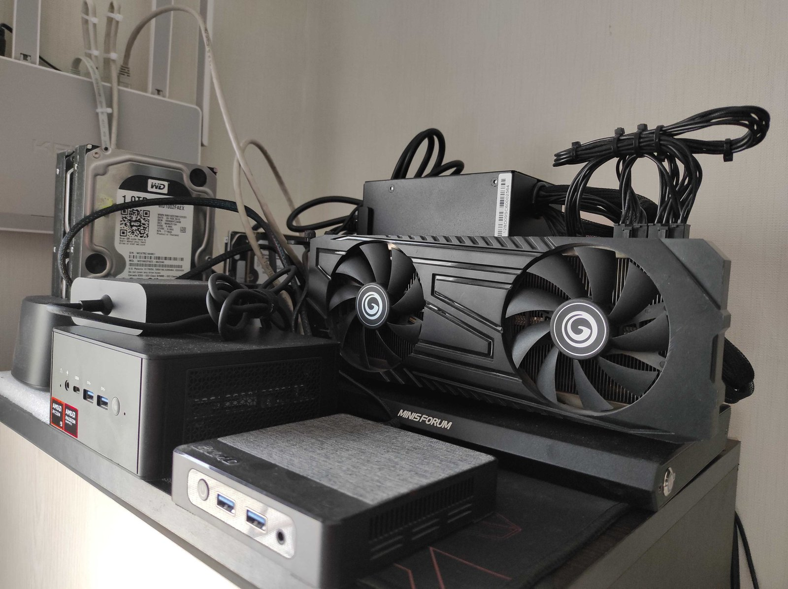
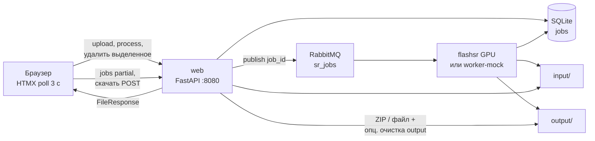
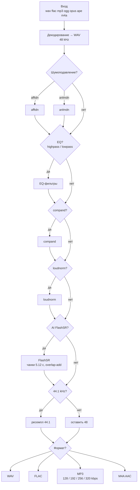
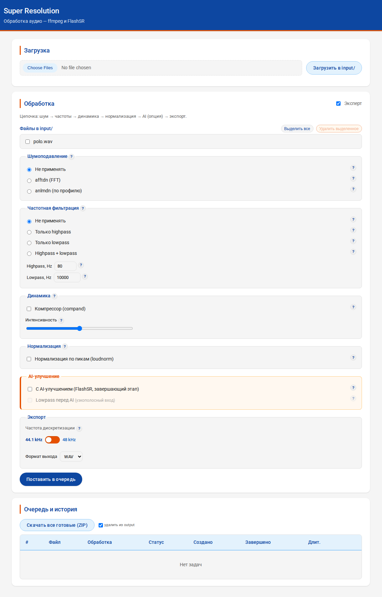
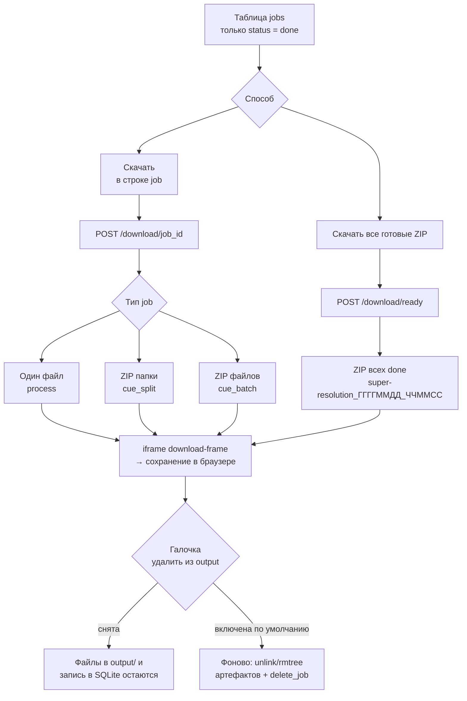

# super-resolution

Docker-обёртка для пакетной обработки аудио: **ffmpeg-цепочка** (шум, EQ, динамика, нормализация) и опциональное **AI-улучшение FlashSR**. Web UI на FastAPI + HTMX, очередь RabbitMQ, журнал в SQLite.

Проект основан на редистрибуции [laion/FlashSR_One-step_Versatile_Audio_Super-resolution](https://huggingface.co/laion/FlashSR_One-step_Versatile_Audio_Super-resolution) и переработан под музыкальные коллекции с выходом **44.1 kHz (CD)** или **48 kHz**.

Изначально написан и отлажен под майнинговую карту **NVIDIA CMP 50HX** (10 ГБ VRAM, без видеовыхода) — как доступный GPU для фоновой пакетной обработки. На других CUDA-картах с достаточной VRAM обычно тоже работает, но целевая конфигурация при разработке — именно CMP 50HX.

[](docs/images/cmp50hx-stand.jpg)

*Стенд на Minisforum UM890 Pro: CMP 50HX, Docker, очередь задач, Web UI. [Полное фото](docs/images/cmp50hx-stand.jpg).*

## Источники и авторы

Вся заслуга за архитектуру модели, исследование, обучение и веса принадлежит оригинальным авторам. Этот репозиторий с ними **не аффилирован**.

| | |
|---|---|
| **Авторы FlashSR** | Jaekwon Im and Juhan Nam (KAIST) |
| **Статья** | [FlashSR: One-step Versatile Audio Super-resolution via Diffusion Distillation](https://arxiv.org/abs/2501.10807) (arXiv:2501.10807) |
| **Демо** | [jakeoneijk.github.io/flashsr-demo](https://jakeoneijk.github.io/flashsr-demo/) |
| **Оригинальный код FlashSR** | [jakeoneijk/FlashSR_Inference](https://github.com/jakeoneijk/FlashSR_Inference) |
| **Оригинальные веса** | [jakeoneijk/FlashSR_weights](https://huggingface.co/datasets/jakeoneijk/FlashSR_weights) |
| **Редистрибуция (основа vendor/)** | [laion/FlashSR_One-step_Versatile_Audio_Super-resolution](https://huggingface.co/laion/FlashSR_One-step_Versatile_Audio_Super-resolution) |
| **Предшественник (AudioSR)** | [haoheliu/versatile_audio_super_resolution](https://github.com/haoheliu/versatile_audio_super_resolution) |

> Есть и другие несвязанные проекты с названием «FlashSR».

## Что делает FlashSR

FlashSR восстанавливает высокочастотные компоненты аудио за **один проход** диффузионной модели. Вход любой sample rate → ресемплинг в 48 kHz → реконструкция недостающих ВЧ.

Применение: апскейл записей с низкой частотой дискретизации; улучшение после lossy-кодеков; постобработка TTS / voice conversion. Модель работает с речью, музыкой и звуковыми эффектами.

## Архитектура



**Режимы worker:**
- `flashsr` (GPU) — полный пайплайн с AI (`MOCK_MODE=0`);
- `worker-mock` — только ffmpeg, без весов и CUDA (`MOCK_MODE=1`).

## Пайплайн обработки (`process`)

Фиксированный порядок этапов. Каждый блок в UI — опция; внутри блока — один выбор.



После FlashSR результат всегда **48 kHz**; переключатель экспорта задаёт ресемпл в **44.1 kHz** (по умолчанию вкл.) или оставляет 48 kHz — и с AI, и без.

**MP3:** при выборе формата в UI появляется битрейт — **320 kbps** по умолчанию, также **256 / 192 / 128**. Кодирование через `libmp3lame -b:a`.

**CUE sheet** (отдельные типы задач):

| Режим | `job_type` | Результат |
|-------|------------|-----------|
| Сплит по INDEX | `cue_split` | `input/<album>/` — wav/flac/mp3 |
| Образ целиком | `process` | один файл через пайплайн выше |
| Несколько FILE | `cue_batch` | пайплайн на каждый файл из CUE |

## Web UI

Открыть **http://localhost:8080** (из LAN: `http://<IP>:8080`).



*Загрузка в `input/`, цепочка ffmpeg + AI, таблица jobs. Скрин с актуального стенда.*

| Возможность | Описание |
|-------------|----------|
| Загрузка | Аудио + `.cue` в `input/` |
| Обработка | Чекбоксы файлов, цепочка фильтров, AI, экспорт |
| Очередь | Таблица jobs, poll 3 с, прогресс-бар при `processing` |
| Прервать | Кооперативная отмена (`cancelled`) |
| Экспорт SR | Переключатель 44.1 ↔ 48 kHz (работает и с AI) |
| Экспорт MP3 | Битрейт 320 / 256 / 192 / 128 kbps (по умолчанию 320) |
| Удалить из input/ | «Выделить все» + «Удалить выделенное» — только отмеченные аудиофайлы; файлы в `queued`/`processing` пропускаются; worker input не трогает |
| Скачать | Поштучно по строке job (`done`); см. [скачивание](#скачивание-результатов) |
| Скачать все готовые | Один ZIP всех `done` с артефактами в output |
| Toast | CUE при загрузке; завершение job (done/failed/cancelled) |

### Удаление из input/

Исходники в `input/` **не удаляются автоматически** после обработки — только вручную через UI.

1. Отметьте чекбоксы у нужных файлов (или «Выделить все»).
2. Нажмите **«Удалить выделенное»** — `POST /input/delete-selected`.
3. Файлы, участвующие в активной задаче (`queued` / `processing`), **не удаляются** — в ответе будет «пропущено (в очереди)».
4. Удаляются только аудио из корня `input/` (не `.cue`).

### Скачивание результатов

Скачивание — это **POST-форма**, а не прямая ссылка: ответ уходит в скрытый `<iframe name="download-frame">`, браузер предлагает сохранить файл. Так же работает и поштучное скачивание, и batch ZIP.



| Что скачивается | `job_type` | Имя архива / файла |
|-----------------|------------|-------------------|
| Один обработанный трек | `process` | `<stem>.<format>` |
| Нарезка по CUE | `cue_split` | `<album_folder>.zip` |
| Пакет по multi-FILE CUE | `cue_batch` | `<cue_stem>_batch.zip` |
| Все готовые сразу | любые `done` | `super-resolution_<UTC timestamp>.zip` |

Галочка **«удалить из output»** (по умолчанию включена): после отдачи файла сервер в фоне удаляет соответствующие артефакты из `output/` (и папку `cue_split` в `input/`) и строку job из SQLite. Снятая галочка — только скачивание, данные на диске и в истории остаются.

RabbitMQ Management: http://localhost:15672 (guest/guest)

Опционально: `APP_PASSWORD` — HTTP Basic (логин `admin`).

## Структура проекта

```
super-resolution/
├── web/app/                    # FastAPI + HTMX UI
├── scripts/
│   ├── worker.py               # consumer RabbitMQ
│   ├── audio_pipeline.py       # цепочка ffmpeg → AI → экспорт
│   ├── ffmpeg_ops.py           # decode, фильтры, export
│   ├── process_options.py      # опции из формы
│   ├── super_resolve.py        # CLI + FlashSR enhance
│   ├── cue_sheet.py            # парсинг CUE
│   ├── cue_split.py            # нарезка по INDEX
│   ├── progress.py             # прогресс консоль + SQLite
│   ├── job_cancel.py           # кооперативная отмена
│   ├── download_utils.py       # скачивание + cleanup
│   └── db.py                   # SQLite jobs
├── vendor/FlashSR/             # код модели (upstream, см. лицензии)
├── data/app.db                 # журнал задач
├── volumes/FlashSR/weights/    # веса (~3.1 ГБ, не в git)
├── docker/
├── compose.yml
├── PLAN.md                     # план этапов
├── input/
└── output/
```

## Требования

- Docker + NVIDIA Container Toolkit (для GPU)
- **Целевой GPU:** NVIDIA CMP 50HX (10 ГБ VRAM) — конфигурация, под которую писался проект
- Минимум ~6 ГБ VRAM для FlashSR (другие карты — на ваш риск)
- Веса в `volumes/FlashSR/weights/` — `make clone` или вручную с [HuggingFace](https://huggingface.co/laion/FlashSR_One-step_Versatile_Audio_Super-resolution/tree/main/weights)

## Быстрый старт

**Hello world за ~2 минуты** (mock, без GPU):

```bash
cp .env.example .env
# в .env: MOCK_MODE=1
make build && make up
```

Откройте http://localhost:8080 → загрузите `.wav`/`.flac` в `input/` → отметьте файл → «Поставить в очередь». Статус появится в таблице jobs.

Полный режим с AI (GPU, веса ~3 ГБ):

```bash
cp .env.example .env
make decode     # или вручную заполнить .env
make build
make clone      # скачать веса (HUGGINGFACE_TOKEN в .env)
make up
```

```bash
make status    # контейнеры, URL, веса
make start     # alias для make up
make stop
make logs
make down
make clone     # веса с HuggingFace (HUGGINGFACE_TOKEN в .env)
make admin     # sqlite-web → http://localhost:8081
make reset     # очистить input/, output/, jobs, очередь RabbitMQ
```

Worker стартует автоматически. Модель грузится один раз; задачи берутся из RabbitMQ.

### Resume

- повторная постановка блокируется только для пары вход→выход в статусе `queued`/`processing`;
- `make down` — необработанные задачи остаются в RabbitMQ;
- история — в SQLite и в таблице на сайте.

## CLI (без Web UI)

```bash
make enhance
# или
make console
python3 scripts/super_resolve.py -i /app/input -o /app/output -w /app/weights
```

```bash
python3 scripts/super_resolve.py -i track.flac -o track_enhanced.wav
python3 scripts/super_resolve.py -i ./input -o ./output
python3 scripts/super_resolve.py -i ./input -o ./output --lowpass
CUDA_VISIBLE_DEVICES=0 python3 scripts/super_resolve.py -i ./input -o ./output
```

### Особенности `super_resolve.py`

| Параметр | Значение |
|----------|----------|
| Обработка модели | 48 kHz, окна 245 760 сэмплов (5.12 с) |
| Длинные треки | overlap-add, симметричный кроссфейд (0.5 с) |
| Выход CLI | 44.1 kHz WAV (через ffmpeg) |
| Каналы | стерео — по каналам L/R |
| Пакетный режим | пропуск уже обработанных файлов |

### Флаг `--lowpass`

По умолчанию выключен. Включать для узкополосного входа (телефония, сильно сжатый поток). В UI — чекбокс «lowpass перед AI».

> **Совет:** при конфликте cudnn в conda: `LD_LIBRARY_PATH="" python3 scripts/super_resolve.py ...`

## Переменные окружения

Скопировать `.env.example` → `.env`:

| Переменная | Описание |
|------------|----------|
| `INPUT_DIR` | каталог с исходниками (default: `./input`) |
| `OUTPUT_DIR` | каталог для результатов (default: `./output`) |
| `WEB_PORT` | порт Web UI (default: `8080`) |
| `ADMINER_PORT` | порт sqlite-web (default: `8081`) |
| `APP_PASSWORD` | пароль UI (логин `admin`); пусто = без авторизации |
| `HUGGINGFACE_TOKEN` | токен HF для `make clone` |
| `LOWPASS` | `1` / `true` — lowpass в worker по умолчанию |
| `MOCK_MODE` | `1` — UI-тест без GPU (mock worker) |
| `MOCK_DELAY_SEC` | пауза имитации в mock (default: `3`) |
| `ENHANCE_AVAILABLE` | опционально переопределить доступность AI в UI (иначе следует `MOCK_MODE`) |

### Секреты (ansible-vault)

`.env` в git не попадает. Рабочие секреты — в **`.env.vault`** (зашифровано, можно коммитить).

```bash
make encode          # локально после правки .env
make decode          # на сервере после git pull
```

Требуется `ansible-vault` (`sudo apt install ansible-core`).

### MOCK_MODE — тест UI без GPU

```bash
# в .env: MOCK_MODE=1
make build && make up
```

Поднимутся `rabbitmq` + `web` + `worker-mock` (без CUDA, без весов). Worker имитирует обработку; очередь и история работают полностью.

На сервере с GPU: `MOCK_MODE=0` — контейнер `flashsr` с FlashSR.

## Документация и участие

| Файл | Описание |
|------|----------|
| [PLAN.md](PLAN.md) | план этапов и архитектура |
| [CONTRIBUTING](CONTRIBUTING) | как вносить изменения |
| [CODE_OF_CONDUCT](CODE_OF_CONDUCT) | правила общения |
| [SECURITY](SECURITY) | сообщения об уязвимостях |
| [LICENSE](LICENSE) | лицензия MIT на код репозитория |

Репозиторий: [gitverse.ru/Max_Cherep/super-resolution](https://gitverse.ru/Max_Cherep/super-resolution)  
Вопросы и баги — через Issues на GitVerse.

## Лицензия

| Компонент | Лицензия |
|-----------|----------|
| `web/`, `scripts/` (кроме vendor), `docker/`, инфраструктура | [MIT](LICENSE) |
| `vendor/FlashSR/` — inference-скрипт LAION | [Apache 2.0](https://www.apache.org/licenses/LICENSE-2.0) — см. [vendor/FlashSR/README.md](vendor/FlashSR/README.md) |
| Подмодули vendor (BigVGAN, HiFi-GAN, …) | MIT / BSD / Apache — файлы `LICENSE` внутри `vendor/` |
| Веса модели (~3 ГБ) | условия авторов на [HuggingFace](https://huggingface.co/laion/FlashSR_One-step_Versatile_Audio_Super-resolution) |

## Citation

```bibtex
@article{im2025flashsr,
  title={FlashSR: One-step Versatile Audio Super-resolution via Diffusion Distillation},
  author={Im, Jaekwon and Nam, Juhan},
  journal={arXiv preprint arXiv:2501.10807},
  year={2025}
}
```

## Ссылки

- [FlashSR paper](https://arxiv.org/abs/2501.10807)
- [LAION redistribution](https://huggingface.co/laion/FlashSR_One-step_Versatile_Audio_Super-resolution)
- [AudioSR](https://github.com/haoheliu/versatile_audio_super_resolution)
- [NVSR](https://github.com/haoheliu/ssr_eval)
- [BigVGAN](https://github.com/NVIDIA/BigVGAN)
- [Diffusers](https://github.com/huggingface/diffusers)
